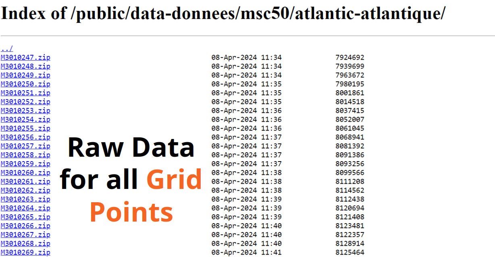
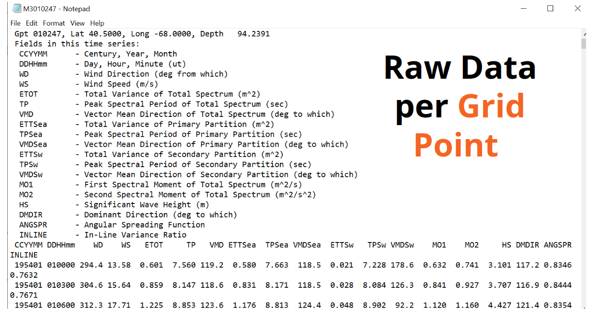
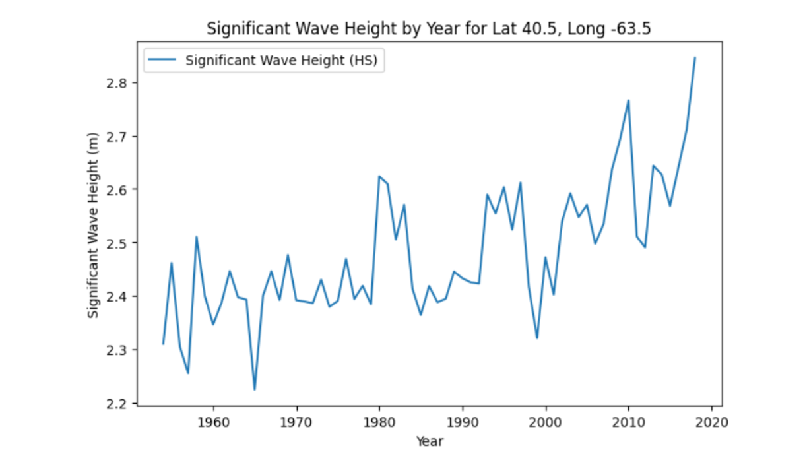
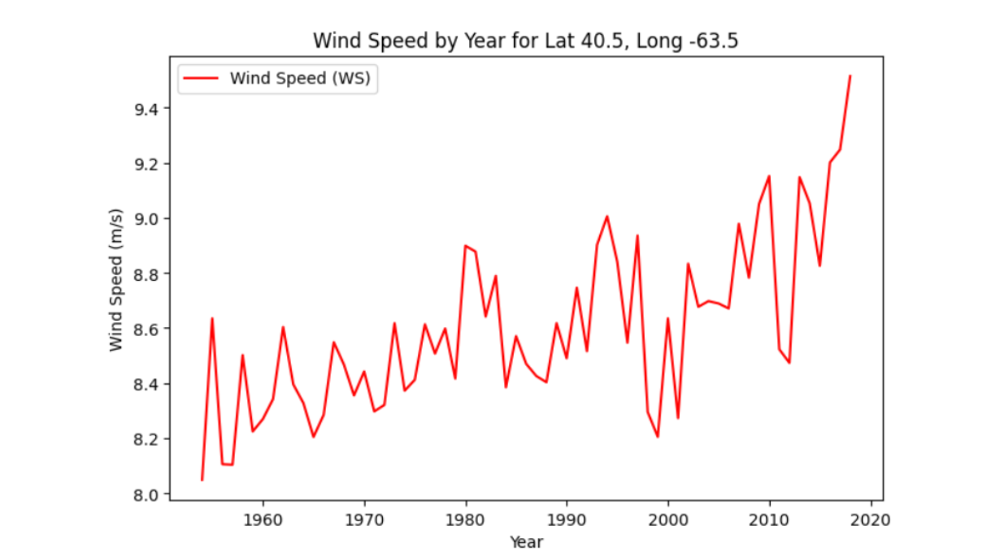
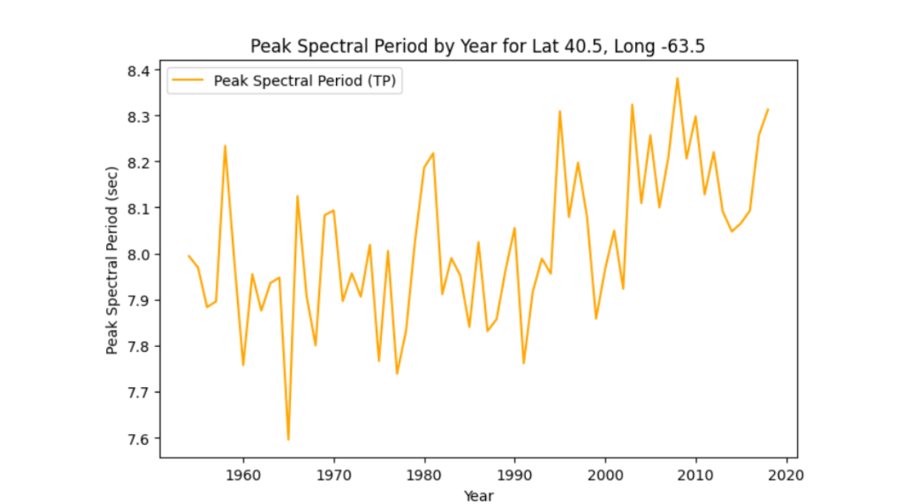
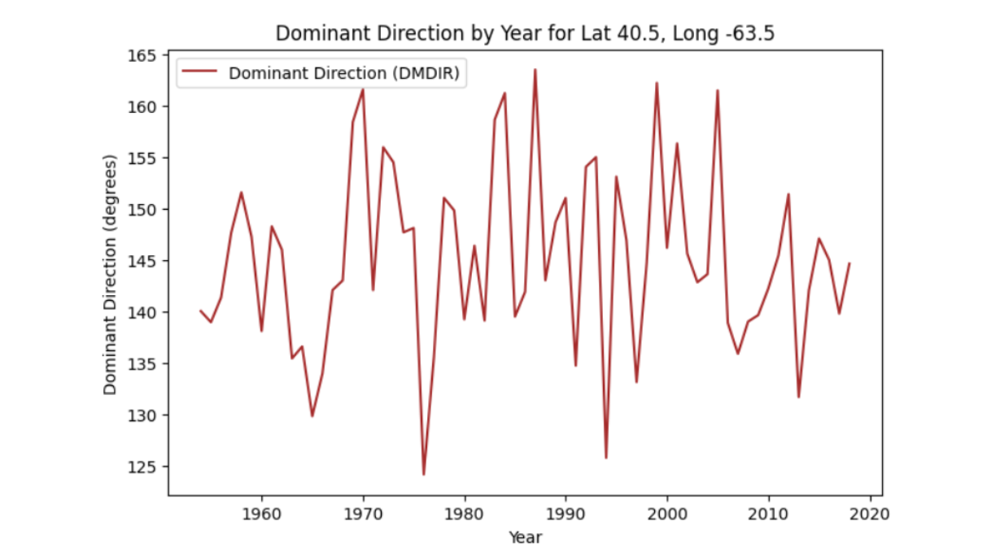

As part of a university project, I found myself wrangling two large wave datasets. Do waves behave consistently across time?, I wondered. The context was ocean wave energy extraction. While it is true that ocean waves are a large source of green energy, it is one of the most nascent in terms of maturity. In other words, we dont know how to best extract wave energy. There are a multitude of Wave Energy Converters (WEC), some like Wavestar which are fixed close to the shoreline, and others, like CETO which are anchored out in the deep sea. Possibly, the only thread connecting these designs is that they are statically fixed where they are installed, and that they expect a certain wave spectrum in order to extract sufficient energy. As my preliminary analysis below shows, wave spectra dont stay static across time. Neither do wave heights, and wind speeds. And given the very high installation costs of many WEC systems, **it is pertinent that ocean wave projects account for wind and wave spectra changes**. 

## How would this app work?
Some contextual **jargon**: There is more than a TB worth of data available in the MSC50 dataset, which is not possible to load into memory all at once. Each 'dataset' corresponds to a 'grid point name' which is implicitly linked to a coordinate. For this project, I had to make sure I only considered the coordinates that fell close enough to Newfoundland. It wasnt trivial to do this, since the data had to be prepped even just to make a mapping between the coordinates and buoys. 

So I decided that I would first run through the data and make the mapping between grid point names and cooridinates and secondly, use this mapping to dynamically fetch the MSC50 data closest to the user's selection of SmartAtlantic data.

1. Choose a SmartAtlantic dataset from the dropdown.
2. Code pulls in the SmartAtlantic dataset, then finds the nearest MSC50 coordinate dataset.
3. "Generate Plot" will draw the graph, with both datasets.

And the friendly **demo**:

## First off, the data. 
We study two datasets: SmartAtlantic, and MSC50. The MSC50 is a huge chunk of data. It starts from 1954 and extends upto 2018. SmartAtlantic is a smaller dataset, and covers a much smaller time range, beginning around 2013, consisting of a few more than a dozen buoys deployed around the island of Newfoundland. For the purpose of this project, I had to narrow down scope, and decided to pick two of these buoys. Each had a different coordinate, of course. 

## Data prep heaven
### SmartAtlantic Data

### MSC50 Data

## Other interesting results from a random coordinate in the Atlantic

So yes, the waves _are_ getting **taller**, **longer**, and more **variant**. 

